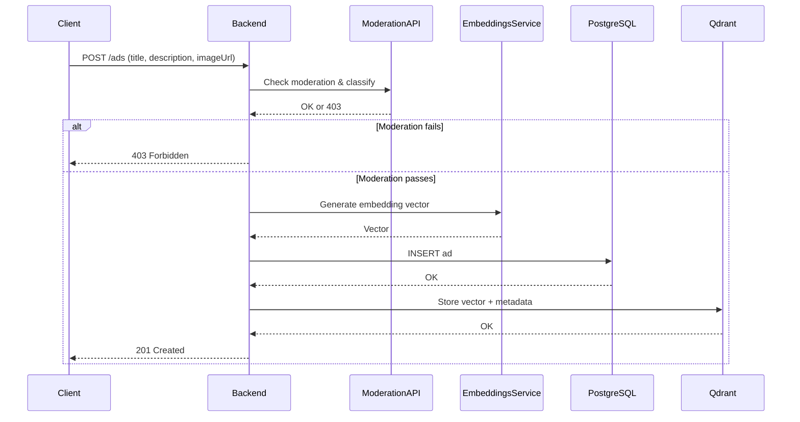
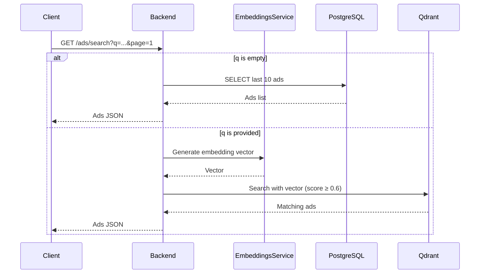

# ADS APP Backend

This is the backend service for **ADS APP**, an application that allows users to publish ads and perform **semantic search** using [Qdrant](https://qdrant.tech/).  
It is built with [Fastify](https://fastify.io/) and integrates PostgreSQL, a local embeddings service, a moderation & classification API, and Qdrant for vector search.

## Prerequisites

1. **PostgreSQL** installed and running.
2. Create a database named `guardads` and the `ads` table:

```sql
CREATE TABLE ads (
  id SERIAL PRIMARY KEY,
  title TEXT,
  description TEXT,
  image_url TEXT,
  category TEXT,
  created_at TIMESTAMP
);
```

3. Node.js v18 or later installed.

    ### Installation & Run
    ```
    npm install
    npm run dev
    ```
--- 
## API Endpoints
### POST /ads
Publishes a new ad.

### Flow:
  1. Sends title and description to a local moderation & classification API (via n8n).
      - If the ad fails moderation → returns 403 Forbidden (not stored).
  2. If valid:
      - Sends data to local embeddings service → generates a vector from title + description.
      - Inserts ad into PostgreSQL.
      - Stores a new point in Qdrant with the embedding vector and ad metadata.
  3. Returns 201 Created on success.

### Example:
  ```
  curl -X POST http://localhost:3000/ads \
    -H "Content-Type: application/json" \
    -d '{
          "title": "Laptop Gamer",
          "description": "16GB RAM, RTX 4060",
          "imageUrl": "https://example.com/laptop.jpg"
        }'
  ```
--- 
### GET /ads/search?q=...&page=1
Searches ads using semantic similarity.

### Flow:

- If no q parameter → returns the 10 most recent ads (paginated).

- If q is provided:
  1. Converts q into a vector via the embeddings service.
  2. Performs semantic search in Qdrant collection, comparing vectors.
  3. Returns results with score ≥ 0.6 for higher precision.

### Example:
  ```
  curl "http://localhost:3000/ads/search?q=RTX%204060"
  ```
---
## Architecture Flow
### POST /ads

### GET /ads/search

---
## Notes
- Moderation step ensures inappropriate ads are not stored.
- Semantic search provides more relevant results than keyword matching.
- Qdrant score threshold (0.6) balances precision and recall.